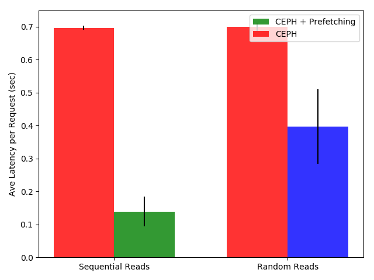
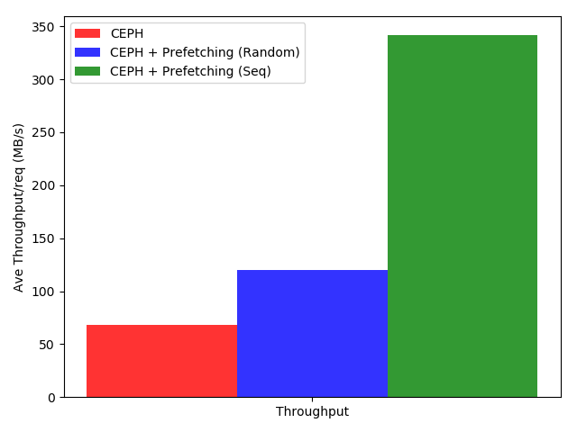

# Implimentaion 

# Evaluation 
We stored 5 files of each 500MB in Ceph and then created 10 requests for each file (1 request for each 50 MB byte-range). Then we sent these request to RGW in sequential and random fashion. As expected sequential read had better performance because after we request the first 50MB RGW automatic-prefetching prefetches the remaining 450MB in the cache as well.

  
  

# Discussion
