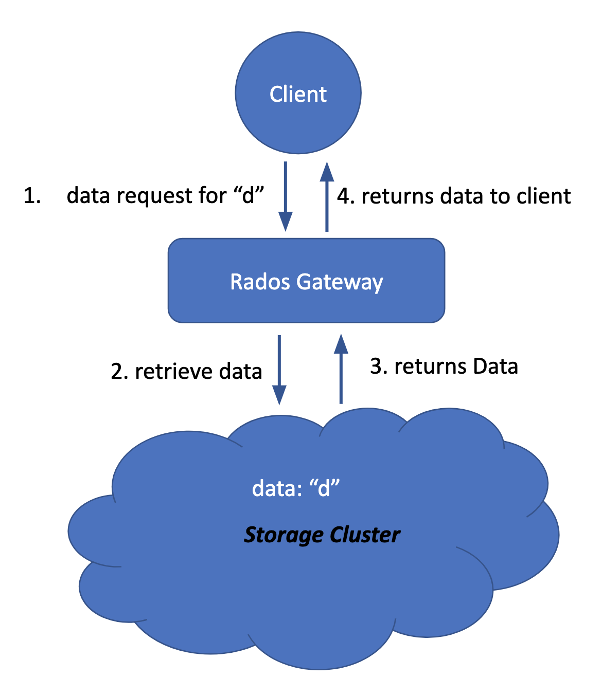

## Introduction, Vision, and Goals Of The Project

Around 2.5 exabyte of data is being generated everyday. This data is generated through the Internet, Social Media, Communication, Digital Photos, IoT and etc. 

Storing data has evolved during the years in order to accommodate the rising needs of applications using this data. The traditional approach to storage – a standalone, specialized storage system – no longer works, for both technical and economic reasons. 

Distributed Storage System (DSS) is an efficient and economic way of managing data. In distributed storage systems, data is stored on multiple commodity/commercial servers. 

## How does a distributed storage system (DSS) alleviate the current problems?

1- Flexibility and scalability
Distributed storage systems use standard servers. It no longer requires a specialized box, to handle just the storage function. This allows scaling by adding more servers and thus increasing capacity and performance linearly. Also, DSS not only allows to have converged/hyper-converged infrastructure, but also allows to keep compute or storage separate on different nodes as well.

2- Speed
In a distributed storage system, any node can read and write in parallel increasing to overall performance of the storage system comparing to a standalone system.

3- Cost
DSS uses standard servers, drives, and network, which are less expensive. In addition, DSS is simpler to manage, which means less staff would be required to run the IT infrastructure.

## Ceph
One of the distributed storage systems is Ceph. it is an open source storage platform, which implements object storage on a single distributed computer cluster, and provides interfaces for object-, block- and file-level storage. Ceph aims primarily for completely distributed operation without a single point of failure, scalable to the exabyte level, and freely available.

Ceph replicates data and makes it fault-tolerant, using commodity hardware and requiring no specific hardware support. As a result of its design, the system is both self-healing and self-managing, aiming to minimize administration time and other costs.

### How does CEPH works

CEPH exposes an interface to the client through a gateway called radosgw (RGW). It layers on top of the Ceph Storage Cluster with its own data formats, and maintains its own user database, authentication, and access control. The RGW uses a unified namespace, which means users can use either the OpenStack Swift-compatible API or the Amazon S3-compatible API. For example, the user can write data using the S3-compatible API with one application and then read data using the Swift-compatible API with another application.

  

#### Making Ceph faster
Due to the spatial locality and temporal locality of data, caching and prefetching are effective methods to improve the I/O performance. Prefetching the data and then caching them on the clients can effectively reduce the number of data requests and dramatically cutting down on the latency to access data, thus resulting in an overall better quality of service (QoS).

Unfortunately, Ceph does not support caching data. As a result, a team of students in Mass Open Cloud (MOC) designed and developed a new two-layer caching system to make Ceph more efficient. 

## Goal of this Project (Prefetching)
Current caching scheme of CEPH is re-active and data is brought into the cache only when a user sends a request for the particular data. Our goal is to make CEPH-RGW cache more pro-active. We are aiming to impliment an interface where depending on the current access pattern RGW can prefetch more data into the cache so future requests can be served from the cache. In this project we are aiming to impliment two types of prefetching

1. User - directed prefetching: A user explicitly tell rgw to bring some "data" into the cache.
2. Automatic prefetching in RGW: RGW prefetches the data into the cache on it's own.
* If the time allows, we will also impliment a cache monitoring tool.

## Scope and Features Of The Project
To develop a prefetching mechanism which intends to improve the current state of reading data from CEPH. The goal for this project is to provide a mechanism that will complement the current performance of the cache by retrieving the chunks of the accessed file preceding the request for that particular file from the user. These two approaches a cache working standalone or a cache integrated with a prefetching mechanism should be compared and evaluated in terms of performance. In addition, a useful interface for system admins should be developed which determines the status of the cache.

## Solution Concept

CEPH provides end-user REST API to store, retrieve and update data. This API used RADOS gateway to interact with the storage clusters. And after discussing with mentors we realized that this would be the best place to implement prefetching. We are planning to implement prefetching in the following way; 

1. Intercept the incoming request 
2. Compute the IDs of the next blocks
3. Fetch the data predicted in 2
4. Update the cache records/lookup tables

To achieve the above, we first need to have a fine understanding of the source code of the RADOS gateway that implements the storage/retrieves data from the storage. 

## Acceptance criteria
An RGW cache coupled with prefetching scheme should improve the overall system throughput as compared to standard CEPH with cache. Moreover user-directed prefetching should reduce the serve time of an object, if it was already brought into the cache.

## Release Planning
Out project timeline is as follows: 
1. Get acquaintance with Ceph, its code, and structure. At the end of this step, we should have a good knowledge about Ceph storage system while having a Ceph system deployed. (Sprint 1)
2. Reading developed caching system code and learn how it does work. (Sprint 2)
3. Designing the prefetching system based on the Ceph and the developed caching system. (Sprint 3)
4. Developing the designed prefetching system on top of the developed caching system. (Srpint 4)
5. Evaluating the implemented prefetching system. (Sprint 5)
6. Developing a mechanism (including an interface) to report the content of the cache to the system admin and the users (Stretch Goal 5)

